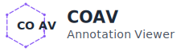
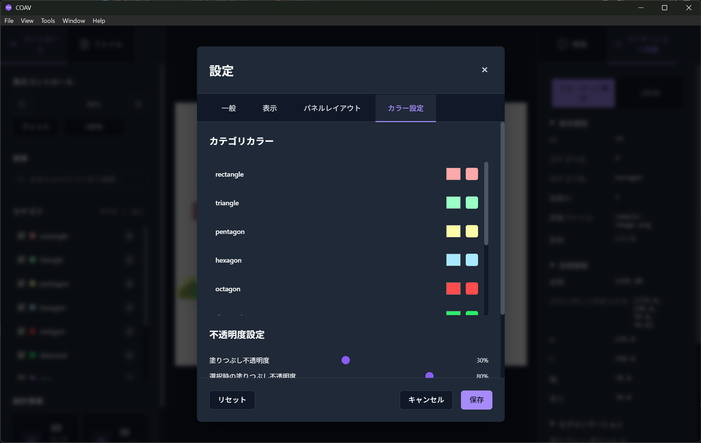

# COAV - COCO Annotation Viewer

<p align="center">
  <picture>
    <source media="(prefers-color-scheme: dark)" srcset="./assets/logo/coav-logo-horizontal-dark.svg">
    <source media="(prefers-color-scheme: light)" srcset="./assets/logo/coav-logo-horizontal-light.svg">
    
  </picture>
</p>

<p align="center">
  <b>A modern desktop application for beautiful and fast visualization of COCO format object detection annotations</b>
</p>

<p align="center">
  <a href="https://github.com/tact-software/coav/releases"></a>
  <a href="https://github.com/tact-software/coav/blob/main/LICENSE"></a>
  <a href="https://github.com/tact-software/coav/stargazers"></a>
</p>

<p align="center">
  <a href="#features">Features</a> •
  <a href="#installation">Installation</a> •
  <a href="#usage">Usage</a> •
  <a href="#development">Development</a> •
  <a href="#contributing">Contributing</a> •
  <a href="#license">License</a>
</p>

<p align="center">
  <b>English</b> | <a href="./README.md">日本語</a>
</p>

---

## Overview

COAV is a COCO (Common Objects in Context) format annotation viewer designed for machine learning researchers, data scientists, and engineers. By focusing purely on viewing and analysis capabilities without complex editing features, we achieve lightweight and high-speed performance.

### Why COAV?

- **Simple**: Pure viewer without annotation editing features
- **Fast**: Smooth performance even with large datasets
- **Beautiful**: Modern UI with dark mode support
- **Feature-rich**: Detailed statistics and filtering capabilities
- **Cross-platform**: Windows, macOS, and Linux support

## Features

### 🖼️ High-Performance Image Display

- Smooth zoom and pan operations
- Efficient display of large images
- Multi-image annotation support

### 🎨 Customizable Display

- Category-specific color palette settings
- Fill and stroke opacity adjustment
- Label and bounding box display toggle
- Dark/Light theme

### 🔍 Advanced Filtering & Search

- Category-based filtering
- Search by ID or category name
- Bulk show/hide toggle

### 📊 Detailed Statistics

- Annotation count and category distribution
- Size analysis (min/max/average)
- Coverage and overlap rate
- Per-image or dataset-wide view toggle

### 🎯 Interactive Operations

- Annotation selection and highlighting
- Detailed information panel
- Keyboard shortcuts
- Drag & drop support

### 🌏 Multi-language Support

- Japanese
- English

## Screenshots

<p align="center">
  
  <br>
  <em>Main Screen - Annotation display and interaction</em>
</p>

<p align="center">
  
  <br>
  <em>Settings Screen - Category color customization</em>
</p>

## Installation

### 📦 Binary Releases (Coming Soon)

> **Note**: Binary releases are currently in preparation. For now, please build from source.

Planned release formats:

- **Windows**: `coav-setup-x.x.x.exe`
- **macOS**: `coav-x.x.x.dmg`
- **Linux**: `coav_x.x.x_amd64.deb` (Ubuntu/Debian) or `coav-x.x.x.AppImage`

### 🔨 Building from Source

#### Prerequisites

- [Rust](https://www.rust-lang.org/) 1.70 or higher
- [Node.js](https://nodejs.org/) 18 or higher, or [Bun](https://bun.sh/)
- [mise](https://mise.jdx.dev/) (recommended)

#### Steps

```bash
# Clone the repository
git clone https://github.com/tact-software/coav.git
cd coav

# Using mise (recommended)
mise install

# Install dependencies
bun install

# Start in development mode
bun tauri:dev

# Production build
bun tauri:build
```

#### Platform-specific Requirements

<details>
<summary>Ubuntu/Debian</summary>

```bash
sudo apt update
sudo apt install libwebkit2gtk-4.1-dev \
  build-essential \
  curl \
  wget \
  file \
  libssl-dev \
  libayatana-appindicator3-dev \
  librsvg2-dev
```

</details>

<details>
<summary>Fedora</summary>

```bash
sudo dnf install webkit2gtk4.1-devel \
  openssl-devel \
  curl \
  wget \
  file \
  libappindicator-gtk3-devel \
  librsvg2-devel
```

</details>

<details>
<summary>macOS</summary>

Xcode Command Line Tools required:

```bash
xcode-select --install
```

</details>

## Usage

### Basic Workflow

1. **Launch COAV**

   - Double-click the application icon
   - Or run `bun tauri:dev` in development mode

2. **Open an Image**

   - Menu → "File" → "Open Image" (`Cmd/Ctrl+O`)
   - Or drag & drop a file into the window

3. **Load Annotations**

   - Menu → "File" → "Open Annotations" (`Cmd/Ctrl+J`)
   - Or drag & drop a COCO JSON file

4. **Navigate & Analyze**
   - Mouse wheel to zoom
   - Drag to pan the image
   - Click to select annotations
   - Use left panel for category filtering
   - Check right panel for detailed information

### Keyboard Shortcuts

| Function         | Windows/Linux | macOS   |
| ---------------- | ------------- | ------- |
| Open Image       | `Ctrl+O`      | `Cmd+O` |
| Open Annotations | `Ctrl+J`      | `Cmd+J` |
| Zoom In          | `Ctrl++`      | `Cmd++` |
| Zoom Out         | `Ctrl+-`      | `Cmd+-` |
| Fit to Window    | `Ctrl+0`      | `Cmd+0` |
| Reset View       | `Ctrl+F`      | `Cmd+F` |
| Search           | `Ctrl+F`      | `Cmd+F` |
| Statistics       | `Ctrl+I`      | `Cmd+I` |
| Settings         | `Ctrl+,`      | `Cmd+,` |

### Data Format

#### Supported Image Formats

- JPEG (.jpg, .jpeg)
- PNG (.png)
- WebP (.webp)
- BMP (.bmp)

#### COCO Annotation Format

```json
{
  "images": [...],
  "annotations": [
    {
      "id": 1,
      "image_id": 1,
      "category_id": 1,
      "bbox": [x, y, width, height],
      "segmentation": [[x1,y1,x2,y2,...]],
      "area": 1234.5
    }
  ],
  "categories": [...]
}
```

## Development

### Architecture

```
coav/
├── src/              # React frontend
│   ├── components/   # UI components
│   ├── stores/       # Zustand state management
│   ├── hooks/        # Custom hooks
│   └── utils/        # Utility functions
├── src-tauri/        # Rust backend
│   ├── src/          # Rust source code
│   └── icons/        # Application icons
├── public/           # Static assets
└── docs/             # Documentation
```

### Tech Stack

- **Frontend**

  - React 18 + TypeScript
  - Konva.js (Canvas rendering)
  - Zustand (State management)
  - i18next (Internationalization)

- **Backend**

  - Rust + Tauri 2.0
  - Serde (JSON processing)

- **Development Tools**
  - Vite (Build tool)
  - Bun (Package manager)
  - ESLint + Prettier (Code quality)

### Scripts

```bash
# Start development server
bun dev           # Vite only
bun tauri:dev     # Tauri + Vite

# Build
bun build         # Frontend only
bun tauri:build   # Complete application

# Code quality
bun lint          # Run ESLint
bun lint:fix      # Auto-fix ESLint issues
bun format        # Run Prettier

# Testing
bun test          # Unit tests (not yet implemented)
bun test:e2e      # E2E tests (not yet implemented)
```

> **Note**: Test infrastructure is currently under development. Test commands are defined for future implementation.

## Contributing

COAV is an open source project. We welcome contributions from everyone!

Please see [CONTRIBUTING.md](./CONTRIBUTING.md) for details.

### How to Contribute

1. Fork this repository
2. Create a feature branch (`git checkout -b feature/amazing-feature`)
3. Commit your changes (`git commit -m 'Add amazing feature'`)
4. Push to the branch (`git push origin feature/amazing-feature`)
5. Create a Pull Request

### Bug Reports & Feature Requests

Please report via the [Issues](https://github.com/tact-software/coav/issues) page.

## License

This project is released under the [MIT License](./LICENSE).

## Acknowledgments

- [Tauri](https://tauri.app/) - Amazing desktop application framework
- [COCO Dataset](https://cocodataset.org/) - Standardization of annotation format
- All [contributors](https://github.com/tact-software/coav/graphs/contributors)

## TODO

The following features are currently under development:

- [ ] **Test Infrastructure**
  - [ ] Unit test implementation
  - [ ] E2E test implementation
  - [ ] CI/CD pipeline setup
- [ ] **Binary Release Automation**
  - [ ] Build automation with GitHub Actions
  - [ ] Platform-specific installer creation

See [TODO.md](./TODO.md) for details.

---

<p align="center">
  Made with ❤️ by <a href="https://github.com/tact-software">TACT</a>
</p>
