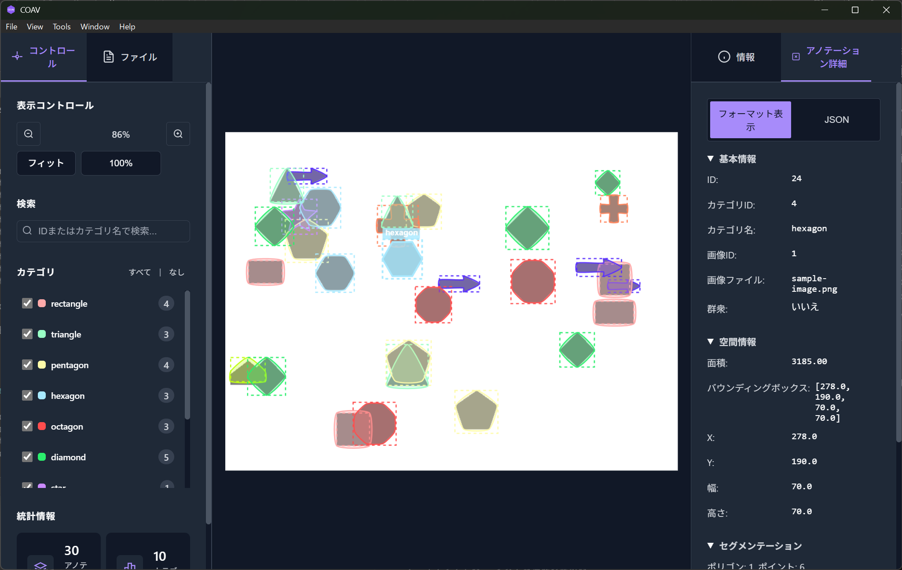

# COAV - COCO Annotation Viewer

<p align="center">
  <picture>
    <source media="(prefers-color-scheme: dark)" srcset="./assets/logo/coav-logo-horizontal-dark.svg">
    <source media="(prefers-color-scheme: light)" srcset="./assets/logo/coav-logo-horizontal-light.svg">
    
  </picture>
</p>

<p align="center">
  <b>COCO形式の物体検知アノテーションを美しく、高速に表示するモダンなデスクトップアプリケーション</b>
</p>

<p align="center">
  <a href="https://github.com/tact-software/coav/releases"></a>
  <a href="https://github.com/tact-software/coav/blob/main/LICENSE"></a>
</p>

---

## 概要

COAVは、機械学習の研究者、データサイエンティスト、エンジニアのために開発された、COCO形式のアノテーションビューアです。

- **シンプル**: アノテーション編集機能を持たない、純粋なビューア
- **高速**: 大規模データセットでも軽快に動作
- **美しい**: モダンなUIとダークモード対応
- **クロスプラットフォーム**: Windows、macOS、Linux対応

## 主な機能

- 高性能な画像表示（ズーム・パン操作）
- カテゴリ別フィルタリング・検索
- 詳細な統計情報（アノテーション数・カテゴリ分布・サイズ分析）
- カスタマイズ可能な表示（カラー・透明度・ダーク/ライトテーマ）
- 日本語・英語対応

## スクリーンショット

<p align="center">
  
</p>

## インストール

### ダウンロード（推奨）

[GitHub Releases](https://github.com/tact-software/coav/releases)から最新版をダウンロードしてください。

| プラットフォーム | ファイル形式 |
|------------------|--------------|
| macOS (Apple Silicon) | `.dmg` |
| macOS (Intel) | `.dmg` |
| Linux (Debian/Ubuntu) | `.deb`, `.AppImage` |
| Linux (Fedora/RHEL) | `.rpm` |

### Homebrew（macOS）

```bash
brew tap tact-software/coav
brew install --cask coav
```

### APT（Debian/Ubuntu）

```bash
# GPGキーを追加
curl -fsSL https://tact-software.github.io/coav/public.gpg | sudo gpg --dearmor -o /usr/share/keyrings/coav-archive-keyring.gpg

# リポジトリを追加
echo "deb [signed-by=/usr/share/keyrings/coav-archive-keyring.gpg] https://tact-software.github.io/coav stable main" | sudo tee /etc/apt/sources.list.d/coav.list

# インストール
sudo apt update
sudo apt install coav
```

> **Note**: Homebrew tap と APT リポジトリはオプションの設定です。詳細は [packaging/INSTALL.md](./packaging/INSTALL.md) を参照してください。

---

## 開発者向け

### 前提条件

- [mise](https://mise.jdx.dev/)

### セットアップ

```bash
git clone https://github.com/tact-software/coav.git
cd coav
mise install
mise run install
```

### 開発

```bash
mise run dev        # 開発サーバー起動
mise run build      # プロダクションビルド
```

### プラットフォーム別の追加要件

<details>
<summary>Ubuntu/Debian</summary>

```bash
sudo apt update
sudo apt install libwebkit2gtk-4.1-dev build-essential curl wget file libssl-dev libayatana-appindicator3-dev librsvg2-dev
```

</details>

<details>
<summary>macOS</summary>

```bash
xcode-select --install
```

</details>

## 使い方

1. **COAVを起動** - `mise run dev`
2. **画像を開く** - メニューから「ファイル」→「画像を開く」（`Cmd/Ctrl+O`）またはドラッグ&ドロップ
3. **アノテーションを読み込む** - 「ファイル」→「アノテーションを開く」（`Cmd/Ctrl+J`）

### キーボードショートカット

| 機能                 | Windows/Linux | macOS   |
| -------------------- | ------------- | ------- |
| 画像を開く           | `Ctrl+O`      | `Cmd+O` |
| アノテーションを開く | `Ctrl+J`      | `Cmd+J` |
| ズームイン           | `Ctrl++`      | `Cmd++` |
| ズームアウト         | `Ctrl+-`      | `Cmd+-` |
| 設定                 | `Ctrl+,`      | `Cmd+,` |

## 開発

### コマンド一覧

すべてのコマンドは `mise run <task>` で実行します。

```bash
mise run dev          # 開発サーバー起動（Tauri + Vite）
mise run build        # プロダクションビルド
mise run lint         # ESLint実行
mise run fix          # ESLint自動修正
mise run format       # Prettier実行
mise run format-check # フォーマットチェック
mise run type-check   # TypeScript型チェック
mise run check        # lint + format-check + type-check
mise run test         # ユニットテスト
mise run test-e2e     # E2Eテスト
mise run rust-fmt     # Rustフォーマット
mise run rust-check   # Clippy実行
```

### 技術スタック

- **フロントエンド**: React 18 + TypeScript, Konva.js, Zustand, i18next
- **バックエンド**: Rust + Tauri 2.0
- **開発ツール**: Vite, Bun, ESLint, Prettier

### ディレクトリ構成

```
coav/
├── src/              # Reactフロントエンド
│   ├── components/   # UIコンポーネント
│   ├── stores/       # Zustand状態管理
│   ├── hooks/        # カスタムフック
│   ├── types/        # TypeScript型定義
│   └── i18n/         # 多言語対応
├── src-tauri/        # Rustバックエンド
└── docs/images/      # スクリーンショット
```

## ライセンス

[MIT License](./LICENSE)

---

<p align="center">
  Made with ❤️ by <a href="https://github.com/tact-software">TACT</a>
</p>
