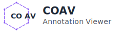

# COAV - Annotation Viewer

<p align="center">
  <picture>
    <source media="(prefers-color-scheme: dark)" srcset="./assets/logo/coav-logo-horizontal-dark.svg">
    <source media="(prefers-color-scheme: light)" srcset="./assets/logo/coav-logo-horizontal-light.svg">
    
  </picture>
</p>

<p align="center">
  <b>COCO形式の物体検知アノテーションを表示するデスクトップアプリケーション</b>
</p>

<p align="center">
  <a href="#主な機能">主な機能</a> •
  <a href="#インストール">インストール</a> •
  <a href="#使い方">使い方</a> •
  <a href="#開発">開発</a> •
</p>

---

## 概要

COAVは、物体検知データセットを扱う研究者や開発者向けのデスクトップアプリケーションです。複雑なアノテーションツールを使わずに、COCO形式のアノテーションを直感的に可視化・確認できます。

### 主な機能

- 🖼️ **高性能な画像表示** - ズーム・パン機能付き
- 🎯 **ポリゴン・バウンディングボックス表示** - カテゴリ別の色分け
- 🔍 **高度なフィルタリング** - カテゴリ、ID別
- 📊 **アノテーション統計** - 詳細情報パネル
- 🖥️ **クロスプラットフォーム** - Windows、Ubuntu対応

## インストール

### ソースからのビルド

#### 前提条件

[mise](https://mise.jdx.dev/)を使用して開発ツールをインストール：

```bash
# miseのインストール
curl https://mise.jdx.dev/install.sh | sh

# リポジトリのクローン
git clone https://github.com/tact-software/coav
cd coav

# 依存関係のインストール
mise install
```

#### ビルドコマンド

```bash
# 依存関係のインストール
bun install
cargo fetch

# 開発モード
bun tauri dev

# プロダクションビルド
bun tauri build
```

## 使い方

### 基本的なワークフロー

1. **アプリケーションの起動**

   - ターミナルで `bun tauri dev` を実行
   - または、ビルドしたアプリケーションをダブルクリックで起動

2. **画像を開く**

   - 「画像を開く」をクリックまたは `Ctrl+O`
   - 画像ファイルをドラッグ&ドロップ

3. **アノテーションの読み込み**

   - 「JSONを開く」をクリックまたは `Ctrl+J`
   - COCO形式のJSONファイルを選択

4. **ナビゲーションと確認**
   - ズーム: マウスホイールまたは `Ctrl +/-`
   - パン: クリック&ドラッグ
   - 選択: アノテーションをクリック
   - フィルタ: 左パネルを使用

### キーボードショートカット

| 操作         | ショートカット |
| ------------ | -------------- |
| 画像を開く   | `Ctrl+O`       |
| JSONを開く   | `Ctrl+J`       |
| ズームイン   | `Ctrl++`       |
| ズームアウト | `Ctrl+-`       |
| 全体表示     | `Ctrl+0`       |

## 対応フォーマット

### 画像フォーマット

- JPEG (.jpg, .jpeg)
- PNG (.png)

### アノテーションフォーマット

- COCO JSONフォーマット(bbox, segmentation)

## 開発

### プロジェクト構造

```
coav/
├── src/              # React TypeScriptフロントエンド
├── src-tauri/        # Rust/Tauriバックエンド
├── docs/             # ドキュメント
├── public/           # 静的アセット
└── tests/            # テストファイル(未対応)
```

### 技術スタック

- **フロントエンド**: React 18、TypeScript、Konva.js
- **バックエンド**: Rust、Tauri 2.0
- **ビルド**: Vite、Bun
- **テスト**: Vitest、Playwright
