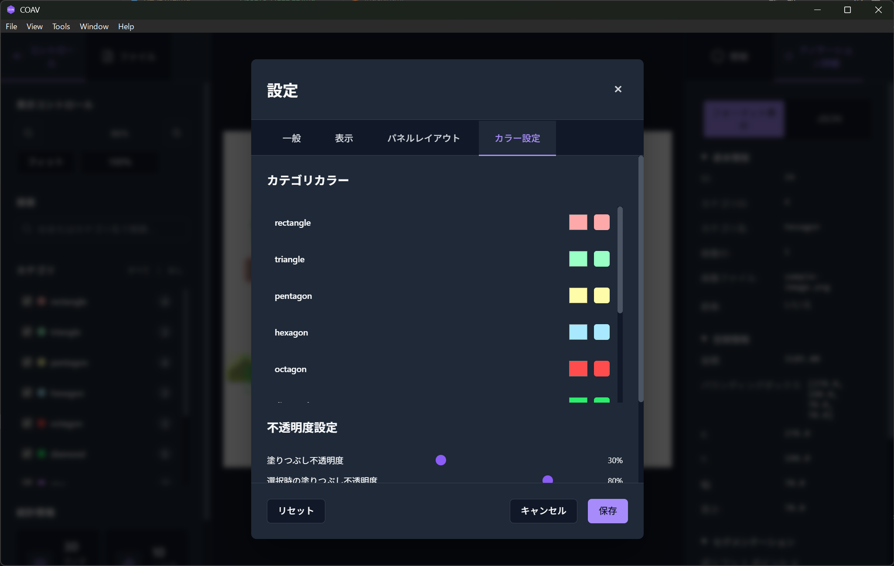

# COAV - COCO Annotation Viewer

<p align="center">
  <picture>
    <source media="(prefers-color-scheme: dark)" srcset="./assets/logo/coav-logo-horizontal-dark.svg">
    <source media="(prefers-color-scheme: light)" srcset="./assets/logo/coav-logo-horizontal-light.svg">
    
  </picture>
</p>

<p align="center">
  <b>COCO形式の物体検知アノテーションを美しく、高速に表示するモダンなデスクトップアプリケーション</b>
</p>

<p align="center">
  <a href="https://github.com/tact-software/coav/releases"></a>
  <a href="https://github.com/tact-software/coav/blob/main/LICENSE"></a>
  <a href="https://github.com/tact-software/coav/stargazers"></a>
</p>

<p align="center">
  <a href="#主な機能">主な機能</a> •
  <a href="#インストール">インストール</a> •
  <a href="#使い方">使い方</a> •
  <a href="#開発">開発</a> •
  <a href="#コントリビューション">コントリビューション</a> •
  <a href="#ライセンス">ライセンス</a>
</p>

<p align="center">
  <a href="./README.en.md">English</a> | <b>日本語</b>
</p>

---

## 概要

COAVは、機械学習の研究者、データサイエンティスト、エンジニアのために開発された、COCO (Common Objects in Context) 形式のアノテーションビューアです。複雑な編集機能を省き、純粋な表示・分析機能に特化することで、軽量かつ高速な動作を実現しています。

### なぜCOAVか？

- **シンプル**: アノテーション編集機能を持たない、純粋なビューア
- **高速**: 大規模データセットでも軽快に動作
- **美しい**: モダンなUIとダークモード対応
- **多機能**: 詳細な統計情報とフィルタリング機能
- **クロスプラットフォーム**: Windows、macOS、Linux対応

## 主な機能

### 🖼️ 高性能な画像表示

- スムーズなズーム・パン操作
- 大画像の効率的な表示
- マルチ画像アノテーション対応

### 🎨 カスタマイズ可能な表示

- カテゴリ別カラーパレット設定
- 塗りつぶし・線の透明度調整
- ラベル・バウンディングボックスの表示切替
- ダーク/ライトテーマ

### 🔍 高度なフィルタリング・検索

- カテゴリ別フィルタ
- ID・カテゴリ名での検索
- 表示/非表示の一括切替

### 📊 詳細な統計情報

- アノテーション数・カテゴリ分布
- サイズ分析（最小/最大/平均）
- カバレッジ・重複率
- 画像単位/データセット全体の切替表示

#### 統計情報について

本アプリケーションで表示される統計情報（ヒストグラム、ヒートマップ、数値統計等）は、データ探索と傾向把握を目的とした**参考値**です。

**注意事項**

- ポリゴン面積の計算は近似アルゴリズムを使用
- 統計値はフィルタリング設定やビン分割設定に依存
- 学術研究や正式な評価には、元のアノテーションデータを直接確認することを推奨

**用途**

- データセットの概要把握
- アノテーション分布の可視化
- 品質チェックの補助

**免責事項**
**本ツールで生成される統計情報や分析結果の正確性について、開発者は一切の責任を負いません。**

- 本ツールの結果に基づく意思決定や判断による損失・損害について責任を負いかねます
- 重要な分析や研究においては、必ず元データや他の検証手段との照合を行ってください
- 商用利用や学術研究での使用は、ユーザー自身の責任において行ってください

### 🎯 インタラクティブな操作

- アノテーションの選択・ハイライト
- 詳細情報パネル
- キーボードショートカット
- ドラッグ&ドロップ対応

### 🌏 多言語対応

- 日本語
- 英語

## スクリーンショット

<p align="center">
  
  <br>
  <em>メイン画面 - アノテーションの表示と操作</em>
</p>

<p align="center">
  
  <br>
  <em>設定画面 - カテゴリカラーのカスタマイズ</em>
</p>

## インストール

### 📦 バイナリリリース（準備中）

> **注記**: バイナリリリースは現在準備中です。現時点では、ソースからのビルドをお願いします。

将来的に以下の形式で提供予定：

- **Windows**: `coav-setup-x.x.x.exe`
- **macOS**: `coav-x.x.x.dmg`
- **Linux**: `coav_x.x.x_amd64.deb` (Ubuntu/Debian) または `coav-x.x.x.AppImage`

### 🔨 ソースからのビルド

#### 前提条件

- [Rust](https://www.rust-lang.org/) 1.70以上
- [Node.js](https://nodejs.org/) 18以上 または [Bun](https://bun.sh/)
- [mise](https://mise.jdx.dev/)（推奨）

#### 手順

```bash
# リポジトリのクローン
git clone https://github.com/tact-software/coav.git
cd coav

# miseを使用する場合（推奨）
mise install

# 依存関係のインストール
bun install

# 開発モードで起動
bun tauri:dev

# プロダクションビルド
bun tauri:build
```

#### プラットフォーム別の追加要件

<details>
<summary>Ubuntu/Debian</summary>

```bash
sudo apt update
sudo apt install libwebkit2gtk-4.1-dev \
  build-essential \
  curl \
  wget \
  file \
  libssl-dev \
  libayatana-appindicator3-dev \
  librsvg2-dev
```

</details>

<details>
<summary>Fedora</summary>

```bash
sudo dnf install webkit2gtk4.1-devel \
  openssl-devel \
  curl \
  wget \
  file \
  libappindicator-gtk3-devel \
  librsvg2-devel
```

</details>

<details>
<summary>macOS</summary>

Xcode Command Line Toolsが必要です：

```bash
xcode-select --install
```

</details>

## 使い方

### 基本的なワークフロー

1. **COAVを起動**

   - アプリケーションアイコンをダブルクリック
   - または開発モードで `bun tauri:dev`

2. **画像を開く**

   - メニューから「ファイル」→「画像を開く」（`Cmd/Ctrl+O`）
   - またはファイルをウィンドウにドラッグ&ドロップ

3. **アノテーションを読み込む**

   - メニューから「ファイル」→「アノテーションを開く」（`Cmd/Ctrl+J`）
   - またはCOCO JSONファイルをドラッグ&ドロップ

4. **操作・分析**
   - マウスホイールでズーム
   - ドラッグで画像を移動
   - アノテーションをクリックで選択
   - 左パネルでカテゴリフィルタ
   - 右パネルで詳細情報確認

### キーボードショートカット

| 機能                 | Windows/Linux | macOS   |
| -------------------- | ------------- | ------- |
| 画像を開く           | `Ctrl+O`      | `Cmd+O` |
| アノテーションを開く | `Ctrl+J`      | `Cmd+J` |
| ズームイン           | `Ctrl++`      | `Cmd++` |
| ズームアウト         | `Ctrl+-`      | `Cmd+-` |
| ウィンドウに合わせる | `Ctrl+0`      | `Cmd+0` |
| リセット             | `Ctrl+F`      | `Cmd+F` |
| 検索                 | `Ctrl+F`      | `Cmd+F` |
| 統計情報             | `Ctrl+I`      | `Cmd+I` |
| 設定                 | `Ctrl+,`      | `Cmd+,` |

### データフォーマット

#### 対応画像形式

- JPEG (.jpg, .jpeg)
- PNG (.png)
- WebP (.webp)
- BMP (.bmp)

#### COCOアノテーション形式

```json
{
  "images": [...],
  "annotations": [
    {
      "id": 1,
      "image_id": 1,
      "category_id": 1,
      "bbox": [x, y, width, height],
      "segmentation": [[x1,y1,x2,y2,...]],
      "area": 1234.5
    }
  ],
  "categories": [...]
}
```

## 開発

### アーキテクチャ

```
coav/
├── src/              # Reactフロントエンド
│   ├── components/   # UIコンポーネント
│   ├── stores/       # Zustand状態管理
│   ├── hooks/        # カスタムフック
│   └── utils/        # ユーティリティ関数
├── src-tauri/        # Rustバックエンド
│   ├── src/          # Rustソースコード
│   └── icons/        # アプリケーションアイコン
├── public/           # 静的アセット
└── docs/             # ドキュメント
```

### 技術スタック

- **フロントエンド**

  - React 18 + TypeScript
  - Konva.js（Canvas描画）
  - Zustand（状態管理）
  - i18next（国際化）

- **バックエンド**

  - Rust + Tauri 2.0
  - Serde（JSON処理）

- **開発ツール**
  - Vite（ビルドツール）
  - Bun（パッケージマネージャ）
  - ESLint + Prettier（コード品質）

### スクリプト

```bash
# 開発サーバー起動
bun dev           # Viteのみ
bun tauri:dev     # Tauri + Vite

# ビルド
bun build         # フロントエンドのみ
bun tauri:build   # 完全なアプリケーション

# コード品質
bun lint          # ESLint実行
bun lint:fix      # ESLint自動修正
bun format        # Prettier実行

# テスト
bun test          # ユニットテスト (未実装)
bun test:e2e      # E2Eテスト (未実装)
```

> **注記**: テスト環境は現在構築中です。テストコマンドは将来的な実装のために定義されています。

## コントリビューション

COAVはオープンソースプロジェクトです。皆様の貢献を歓迎します！

詳細は[CONTRIBUTING.md](./docs/ja/CONTRIBUTING.md)をご覧ください。

### 貢献方法

1. このリポジトリをフォーク
2. フィーチャーブランチを作成 (`git checkout -b feature/amazing-feature`)
3. 変更をコミット (`git commit -m 'Add amazing feature'`)
4. ブランチにプッシュ (`git push origin feature/amazing-feature`)
5. プルリクエストを作成

### バグ報告・機能要望

[Issues](https://github.com/tact-software/coav/issues)ページから報告してください。

## ライセンス

このプロジェクトは[MITライセンス](./LICENSE)の下で公開されています。

## 謝辞

- [Tauri](https://tauri.app/) - 素晴らしいデスクトップアプリケーションフレームワーク
- [COCO Dataset](https://cocodataset.org/) - アノテーションフォーマットの標準化
- すべての[コントリビューター](https://github.com/tact-software/coav/graphs/contributors)の皆様

## TODO

現在、以下の機能を開発中です：

- [ ] **テスト環境の構築**
  - [ ] ユニットテストの実装
  - [ ] E2Eテストの実装
  - [ ] CI/CDパイプラインの設定
- [ ] **バイナリリリースの自動化**
  - [ ] GitHub Actionsによるビルド自動化
  - [ ] 各プラットフォーム向けのインストーラー作成

詳細は開発計画をご確認ください。

---

<p align="center">
  Made with ❤️ by <a href="https://github.com/tact-software">TACT</a>
</p>
