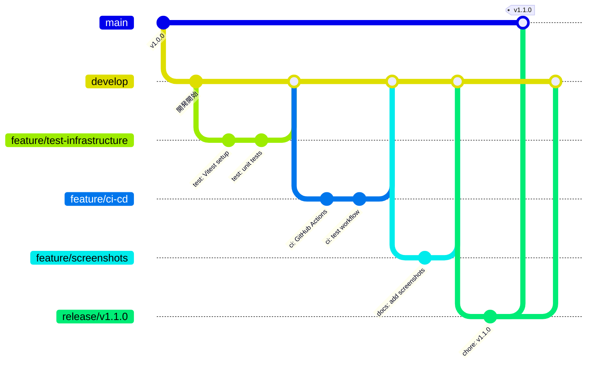
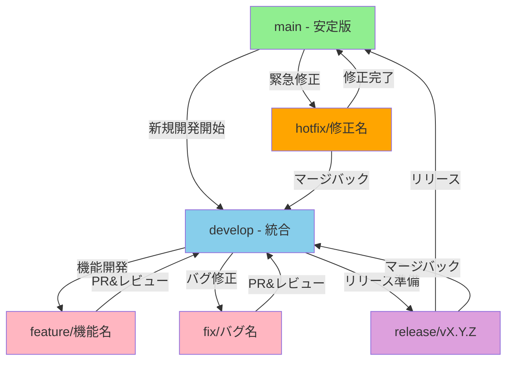
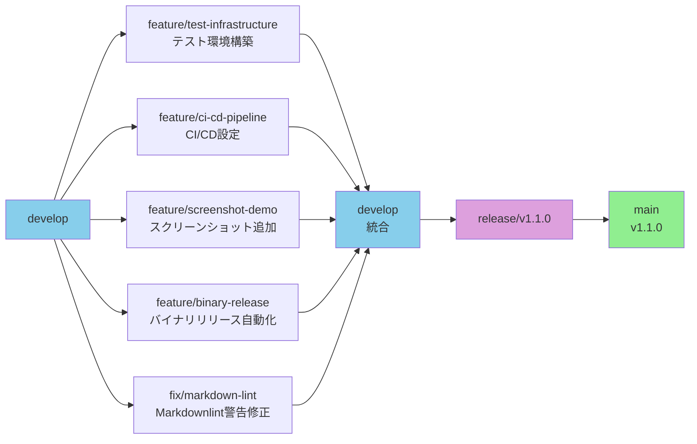
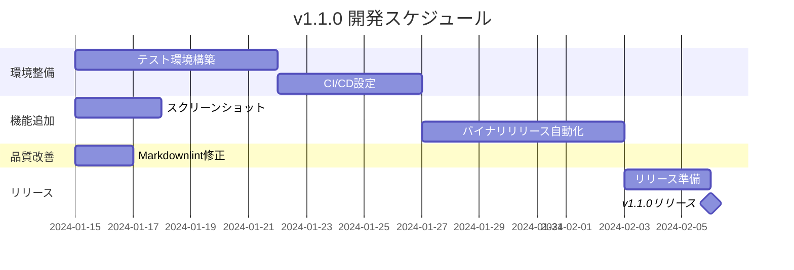

# ブランチ運用戦略

## 概要

COAVプロジェクトでは、効率的な開発とリリース管理のため、以下のブランチ戦略を採用します。

## ブランチフロー図



## 開発フロー詳細



## ブランチ構成

### 🌟 メインブランチ

#### `main`
- **用途**: プロダクション準備完了のコード
- **特徴**: 常に安定していて、リリース可能な状態
- **保護**: 直接pushは禁止、PRのみでマージ

#### `develop`
- **用途**: 次回リリースの開発統合ブランチ
- **特徴**: 新機能が統合される場所
- **マージ元**: featureブランチ、fixブランチ

### 📝 作業ブランチ

#### `feature/*`
- **用途**: 新機能開発
- **命名規則**: `feature/機能名` または `feature/issue番号-機能名`
- **例**: 
  - `feature/auto-update`
  - `feature/123-screenshot-tool`
  - `feature/test-infrastructure`
- **ベース**: `develop`
- **マージ先**: `develop`

#### `fix/*`
- **用途**: バグ修正（緊急でないもの）
- **命名規則**: `fix/バグ内容` または `fix/issue番号-バグ内容`
- **例**: 
  - `fix/memory-leak`
  - `fix/456-panel-crash`
- **ベース**: `develop`
- **マージ先**: `develop`

#### `docs/*`
- **用途**: ドキュメントの更新
- **命名規則**: `docs/内容`
- **例**: 
  - `docs/api-guide`
  - `docs/readme-update`
- **ベース**: `develop`
- **マージ先**: `develop`

#### `refactor/*`
- **用途**: コードのリファクタリング
- **命名規則**: `refactor/対象`
- **例**: `refactor/component-structure`
- **ベース**: `develop`
- **マージ先**: `develop`

#### `test/*`
- **用途**: テストの追加・修正
- **命名規則**: `test/内容`
- **例**: 
  - `test/unit-tests`
  - `test/e2e-setup`
- **ベース**: `develop`
- **マージ先**: `develop`

#### `chore/*`
- **用途**: ビルド設定、依存関係更新など
- **命名規則**: `chore/内容`
- **例**: `chore/dependencies-update`
- **ベース**: `develop`
- **マージ先**: `develop`

#### `hotfix/*`
- **用途**: 緊急バグ修正
- **命名規則**: `hotfix/バージョン-内容`
- **例**: `hotfix/1.0.1-critical-bug`
- **ベース**: `main`
- **マージ先**: `main` と `develop`

#### `release/*`
- **用途**: リリース準備
- **命名規則**: `release/vX.Y.Z`
- **例**: `release/v1.1.0`
- **ベース**: `develop`
- **マージ先**: `main` と `develop`

## ワークフロー例

### 1. 新機能開発（テスト環境構築の例）

```bash
# developブランチから開始
git checkout develop
git pull origin develop

# featureブランチ作成
git checkout -b feature/test-infrastructure

# 作業とコミット
# ... ユニットテスト環境追加
git add .
git commit -m "test: add unit test infrastructure with Vitest"

# ... E2Eテスト環境追加
git add .
git commit -m "test: add E2E test setup with Playwright"

# ... CI設定追加
git add .
git commit -m "ci: add GitHub Actions workflow for testing"

# developにマージ（PR経由）
git push origin feature/test-infrastructure
# GitHub上でPRを作成 → レビュー → マージ
```

### 2. 複数機能の並行開発

```bash
# 開発者A: スクリーンショット機能
git checkout -b feature/screenshot-tool develop

# 開発者B: 自動アップデート機能
git checkout -b feature/auto-update develop

# それぞれ独立して開発・コミット
# 完成したものから順次developへマージ
```

### 3. リリース準備（v1.1.0の例）

```bash
# developからリリースブランチ作成
git checkout -b release/v1.1.0 develop

# バージョン更新
bun version:update 1.1.0

# CHANGELOG更新
# ... CHANGELOG.mdを編集

git add .
git commit -m "chore: prepare release v1.1.0"

# 最終テスト・修正
# ... 必要に応じて修正

# mainとdevelopへマージ
git checkout main
git merge --no-ff release/v1.1.0
git tag -a v1.1.0 -m "Release version 1.1.0"

git checkout develop
git merge --no-ff release/v1.1.0
```

## 推奨される運用ルール

### developブランチへの直接コミット

原則として **developブランチへの直接コミットは避ける** ことを推奨します。

#### ❌ 避けるべきケース
- 新機能の追加
- 大きなリファクタリング
- 複雑なバグ修正
- 破壊的変更を含む修正

#### ⭕ 許容されるケース
- **軽微な修正**
  - タイポの修正
  - コメントの追加・修正
  - 明らかなバグの1行修正
- **緊急対応**
  - ビルドが壊れた時の修正
  - CI/CDの緊急修正
- **メンテナンス作業**
  - バージョン番号の更新
  - 依存関係の軽微なアップデート

#### 推奨フロー
```bash
# ❌ 避けるべき
git checkout develop
git commit -m "feat: 新機能追加"  # 直接コミット

# ⭕ 推奨
git checkout -b feature/new-feature develop
git commit -m "feat: 新機能追加"
git push origin feature/new-feature
# PRを作成してレビュー後マージ
```

### 小さな機能の扱い方

機能の大きさに応じて、適切な方法を選択します。

#### 🏃 短期ブランチ（推奨）
**作業時間: 数時間〜1日程度**

小さな機能でも原則ブランチを作成しますが、素早くマージします：

```bash
# 朝: ブランチ作成
git checkout -b feature/add-tooltip develop

# 作業・コミット（1-3コミット程度）
git add .
git commit -m "feat: add tooltip to annotation panel"

# 夕方: PR作成・レビュー・マージ
git push origin feature/add-tooltip
# 即座にPR → レビュー → マージ（同日中）
```

**メリット**:
- レビューの機会を確保
- 履歴が明確
- CIでのテスト実行

#### 🎯 関連機能のグループ化
**複数の小機能がある場合**

関連する小機能は1つのブランチにまとめることも可能：

```bash
git checkout -b feature/ui-improvements develop

# 複数の小さな改善
git commit -m "feat: add tooltip to annotation panel"
git commit -m "feat: improve button hover states"
git commit -m "feat: add keyboard shortcut hints"

# まとめてPR
```

#### 📏 判断基準

| 項目 | 個別ブランチ | グループ化 | develop直接 |
|------|------------|-----------|------------|
| 機能の独立性 | 高い | 関連あり | - |
| 作業時間 | 1日以上 | 数時間〜1日 | 30分以内 |
| コミット数 | 3以上 | 2-5 | 1 |
| 影響範囲 | 中〜大 | 小〜中 | 極小 |
| レビュー必要性 | 必須 | 推奨 | 任意 |

#### 実例

```bash
# ⭕ ブランチ作成すべき例（小さくても）
- 新しいアイコンの追加とその使用
- ショートカットキーの追加
- 新しいユーティリティ関数の追加

# 🤔 グループ化できる例
- 複数のUIツールチップ追加
- 関連する複数のアイコン追加
- 同一画面の複数の小改善

# ⭕ develop直接でも可の例
- READMEのタイポ修正（1文字）
- コメントの文言修正
- 既存の定数の値を1つ変更
```

### コミット単位
- **機能単位**: 1つの機能追加は1つのコミット
- **論理的な単位**: 関連する変更はまとめる
- **レビュー可能**: 大きすぎず小さすぎないサイズ

### PR作成タイミング
- **早期PR**: WIP (Work In Progress) でも早めにPRを作成
- **ドラフトPR**: 開発中はドラフトとしてマーク
- **レビュー準備**: 完成したらReady for reviewに変更

### マージ戦略
- **Squash and merge**: featureブランチは通常これを使用
- **Create a merge commit**: releaseブランチはこれを使用
- **Rebase and merge**: 単純な修正のみ

## 次期リリース（v1.1.0）に向けた計画例



各機能は独立して開発し、完成次第developにマージしていきます。

## タイムライン例



## 利点

1. **並行開発**: 複数の開発者が独立して作業可能
2. **履歴の明確化**: 機能単位でのコミット履歴
3. **安定性**: mainブランチは常に安定
4. **柔軟性**: 機能の完成順序に依存しない

## 注意点

- `develop`ブランチは定期的に`main`の変更を取り込む
- 長期間のfeatureブランチは定期的に`develop`をマージ
- コンフリクトは早期に解決
- 各ブランチは用途に応じて適切に削除